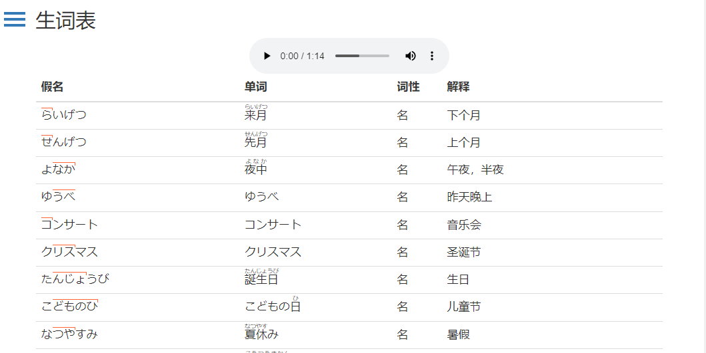
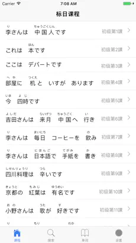
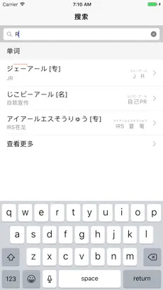
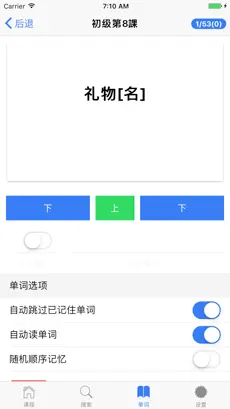

# 冰河标日学习日志

以《新版中日交流标准日本语》教材为参考制作。
辅助作者顺利通过了日语二级考试。

## 功能特色

- 课文阅读：根据《新版中日交流标准日本语》教材对课文排序，循序渐进学习日语
- 单词展示：单词有假名标注，假名上有直观的重音标志
- 笔记标注：辅助提升的实用学习笔记
- 语法学习：分门别类的语法说明
- 智能回放：有助于学习内容的学习与记忆
- 中文翻译：内嵌课文、单词的中文翻译，方便用户的阅读与理解

## 代码优势

- 开源易用，无门槛，操作简单易于上手
- 创新使用了“假名直接标注”、“单词重音标识”等呈现形式，软件定义了一套纯文本语法规范
- 手机版与电脑版共用核心库，便于移植

# UI展示

## 电脑版

## 手机版

# 快速开始

## 电脑版

[在线体验](http://japan.icerdesign.com/)

## 手机版

[iOS Store](https://apps.apple.com/jp/app/标准日本语学习日志-初级-笔记-背单词-查语法/id1292939660)

# License

The MIT License (MIT)